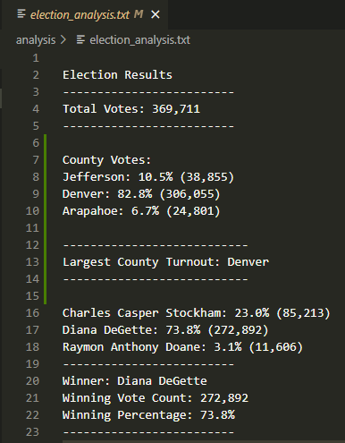
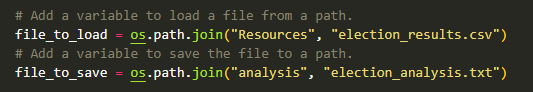
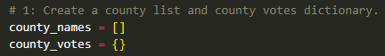
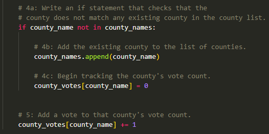

# Election_Analysis

## Election Audit Overview
A Colorado Board of Elections employee needs the following tasks done to complete the election audit of a recent local congressional election.

1. Calculate the total number of votes cast.
2. Get a complete list of candidates who received votes.
3. Calculate the total number of votes each candidate received.
4. Calculate the percentage of votes each candidate won.
5. Determine the winner of the election based on popular vote.

## Resources Used
* Data Source: election_results.csv
* Software: Python 3.10 (64 bit), Visual Studio Code, 1.68.1

## Election Audit Results

* 369,711 total votes cast in the election
* Voter turnout count / percentage by county:

    - Jefferson County / 38,855 votes / 10.5%
    - Denver County / 306,055 votes / 82.8%
    - Araphoe County / 24,801 votes / 6.7%
    
* Denver County had the highest turnout.

* Candidates in election:

  - Charles Casper Stockham  
  - Diana DeGette
  - Raymon Anthony Doane 

* Candidate results were:
  - Charles Casper Stockham  received 23% of the vote and 85,213 number of votes.
  - Diana DeGette received 73.8% of the vote and 272,892 number of votes.
  - Raymon Anthony Doane received 3.1% of the vote and 11,606 number of votes.
 
* Winner of the election was:
  * Diana DeGette won the election by receiving 73.8% of the vote and 272,892 number of votes.
  
* Election Data Audit Results confirmed by visual of election results from txt file output:

  
   
  ## Election Audit Summary

  The coding used for this audit can be applied to any election by updating the source file and text output file as shown below:

  

   Addtionally, there is opportunity to add more data to analyze if needed, such as voter demographics, country etc.  Code can be added/updated in blocks - similar to what is seen below:

  
  
  
